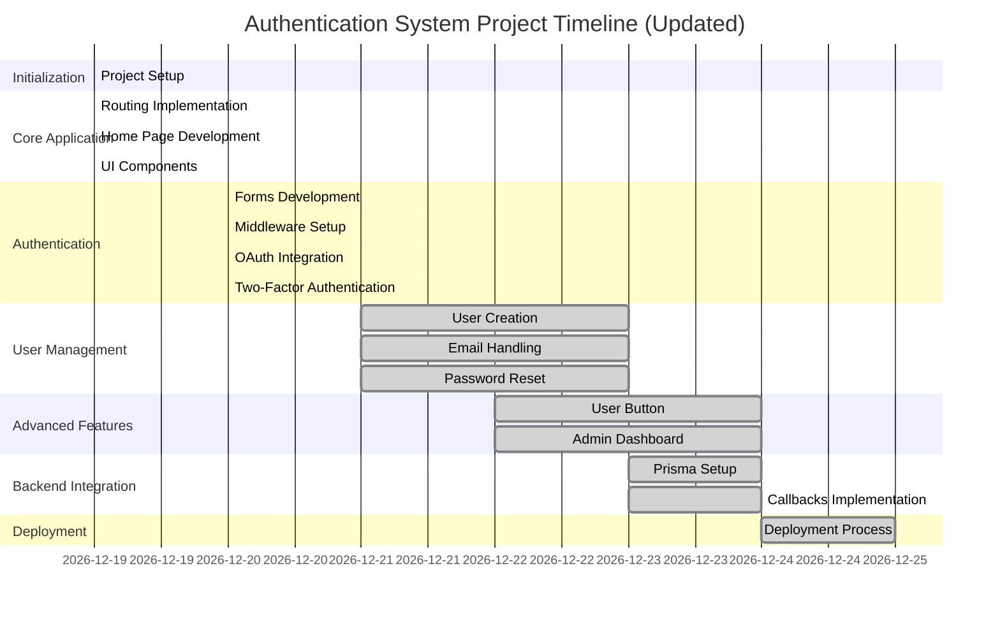

# Authentication System


## Table of Contents
- [Project Overview](#project-overview)
- [Features](#features)
- [Installation](#installation)
- [Usage](#usage)
- [Key Features](#key-features)
- [Project Structure](#project-structure)
- [Milestones](#milestones)
- [Gantt Chart](#gantt-chart)
- [Contributing](#contributing)


---

## Project Overview

**Authentication System** is a comprehensive and secure solution designed to streamline user management, authentication, and authorization for web applications. Addressing the common challenges of implementing robust security measures, this system integrates multiple authentication methods, including OAuth and Two-Factor Authentication (2FA), to enhance both security and user experience. Whether you're building a small project or a large-scale application, our system offers flexibility and scalability to meet your needs.

---

## Features

- **User Authentication:**
  - **Email and Password Login:** Secure login system using traditional email and password credentials.
  - **OAuth Integration with Google and GitHub:** Allow users to authenticate using their existing Google or GitHub accounts for convenience and enhanced security.
  - **Two-Factor Authentication (2FA):** Adds an extra layer of security by requiring a second form of verification via email or authenticator apps.

- **User Management:**
  - **User Registration and Profile Management:** Enables users to create accounts and manage their personal information.
  - **Email Verification and Password Reset:** Ensures account security by verifying user emails and providing secure password recovery options.
  - **Admin Dashboard:** A centralized interface for administrators to manage users and oversee content effectively.

- **Advanced Features:**
  - **Responsive and Reusable UI Components:** Provides a consistent and adaptable user interface across different devices.
  - **Middleware for Session Handling and Route Protection:** Secures application routes and manages user sessions seamlessly.
  - **Backend Integration with Prisma and a Relational Database:** Utilizes Prisma for efficient database interactions and management.

- **Deployment:**
  - **Ready for Deployment on Platforms like Vercel, AWS, or Netlify:** Simplifies the deployment process across popular cloud platforms.
  - **Continuous Integration/Continuous Deployment (CI/CD) Pipelines:** Automates testing and deployment to ensure rapid and reliable updates.

---

## Installation

Follow these steps to set up the project locally:

1. **Clone the Repository:**
   ```bash
   git clone https://github.com/yourusername/comprehensive-auth-system.git
   cd comprehensive-auth-system
   ```

2. **Install Dependencies:**
   ```bash
   # For server
   cd server
   npm install

   # For client
   cd ../client
   npm install
   ```


3. **Run the Application:**
   ```bash
   # In server directory
   npm run dev

   # In client directory
   npm run start
   ```

---

## Usage

Once the application is running locally:

1. **Access the Home Page:**
   - Open your browser and navigate to `http://localhost:3000` to view the homepage.
  

2. **Register a New User:**
   - Click on the "Register" button and fill in the required details.
   - After registration, verify your email through the link sent to your inbox.


3. **Login:**
   - Use your registered credentials or sign in via Google/GitHub OAuth.


4. **Enable Two-Factor Authentication (2FA):**
   - Navigate to the settings page to enable 2FA for enhanced security.
 

5. **Admin Dashboard:**
   - Access the admin panel to manage users and content.
   - **Note:** Admin privileges are granted to specific users. To obtain admin access, contact the system administrator.


---

## Milestones

### **Milestone 1: Project Initialization**


- **Deliverables:**
  - Repository initialized with server and client directories
  - Basic project setup with required dependencies
  - Project demo prepared and reviewed
  - Initial routing implemented

### **Milestone 2: Core Application Features**

- **Deliverables:**
  - Functional home page with reusable card components
  - Comprehensive routing system with protected and public routes
  - Responsive design implemented for core UI components

### **Milestone 3: Authentication System**
-
- **Deliverables:**
  - Fully functional login and registration forms
  - Authentication middleware deployed
  - OAuth integration with Google and GitHub
  - Two-Factor Authentication (2FA) implemented

### **Milestone 4: User Management System**

- **Deliverables:**
  - User creation and management functionalities
  - Email verification and password reset workflows
  - Implementation of dynamic user profile buttons

### **Milestone 5: Advanced Features**

- **Deliverables:**
  - Admin dashboard for user and content management
  - Settings page for user profile updates
  - Integration of sponsor/demo sections

### **Milestone 6: Backend & Database Integration**

- **Deliverables:**
  - Database schema setup with Prisma
  - Implementation of authentication callbacks
  - Optimized server-client communication

### **Milestone 7: Deployment**

- **Deliverables:**
  - Production-ready build of the application
  - Deployment on chosen cloud platforms (e.g., Vercel, AWS, Netlify)
  - CI/CD pipelines configured and operational
  - Final project demo conducted


---

## Gantt Chart



---

## Contributing

Contributions are welcome! Please follow these steps:

1. Fork the repository.
2. Create a new branch (`git checkout -b feature/YourFeature`).
3. Commit your changes (`git commit -m 'Add some feature'`).
4. Push to the branch (`git push origin feature/YourFeature`).
5. Open a Pull Request.

Please ensure your code adheres to the project's coding standards and includes appropriate tests.

---


